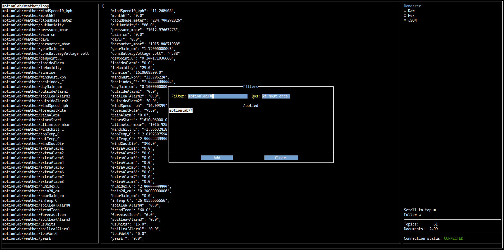

# Mqtty
Mqtty is a small TUI utility for subscribing to and publishing MQTT messages.



## Installation
```bash
go get github.com/halvfigur/mqtty
```

Or download a release from the [release page](https://github.com/halvfigur/mqtty/releases).
